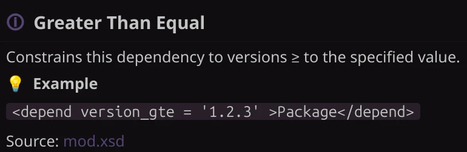

<div align = center >

# Addon Manifest Schema

This repository contains the source files for the XML  
Schema ( XSD ) used for the [FreeCAD Addon Manifest].

[![Button Discord]][Discord]  
[![Button Documentation]][Documentation]  
[![Button Contribute]][Contribute]

</div>

<br/>

<!----------------------------------------------------------------------------->

## 📷 Showcase

The schema not only provides validation, autocomplete  
and examples but also tooltips, here is one of them.



<br/>

<!----------------------------------------------------------------------------->

## 💬 Usage

Use the following snippet to reference  
this schema in your `<package>` tag.

```xml
<package
    Manifest:schemaLocation = 'HTTPS://Addons.FreeCAD.Org/Manifest https://Addons.FreeCAD.Org/Manifest'
    xmlns:Manifest = 'http://www.w3.org/2001/XMLSchema-instance'
    xmlns = 'HTTPS://Addons.FreeCAD.Org/Manifest'
>
```

<br/>

<!----------------------------------------------------------------------------->

### 📍 Endpoints

Currently FreeCAD only supports one endpoint  
that hosts the **latest** version of the schema at:

```md
https://Addons.FreeCAD.Org/Manifest.xsd
```

<br/>

<!----------------------------------------------------------------------------->

### 💾 Older Versions

In case you need to use an older version of the schema,  
you can reference one of the [GitHub Releases] like so:

```md
https://github.com/FreeCAD/FreeCAD-Addon-Manifest-Schema/releases/download/<Version>/Schema.xsd
```

```md
https://github.com/FreeCAD/FreeCAD-Addon-Manifest-Schema/releases/download/v1.0/Schema.xsd
```

<br/>

<!----------------------------------------------------------------------------->

### 📄 Integration

The following code demonstrates how you can  
reference this schema in your addon manifest:

```xml
<?xml
    version = '1.0'
    encoding = 'UTF-8'
    standalone = 'no'
?>
<package
    Manifest:schemaLocation = 'HTTPS://Addons.FreeCAD.Org/Manifest https://Addons.FreeCAD.Org/Manifest'
    xmlns:Manifest = 'http://www.w3.org/2001/XMLSchema-instance'
    xmlns = 'HTTPS://Addons.FreeCAD.Org/Manifest'
>
```

<br/>

<!----------------------------------------------------------------------------->

### 📖 Examples

The following manifests demonstrate  
different configurations you may use.

| File | Contents |
|:-----|:--------|
| [`Everything.xml`] | Manifest with all available elements & attributes.

<br/>

<!----------------------------------------------------------------------------->

[Button Documentation]: https://img.shields.io/badge/Documentation-4793CC?style=for-the-badge
[Button Contribute]: https://img.shields.io/badge/Contribute-24582e?style=for-the-badge
[Button Discord]: https://img.shields.io/badge/Discord-5561EC?style=for-the-badge

[FreeCAD Addon Manifest]: https://wiki.freecad.org/Package_Metadata
[GitHub Releases]: https://github.com/FreeCAD/FreeCAD-Addon-Manifest-Schema/releases
[Discord]: https://discord.gg/w2cTKGzccC

[`Everything.xml`]: ./Assets/Examples/Everything.xml
[Documentation]: ./Docs/README.md
[Contribute]: ./.github/CONTRIBUTING.md
